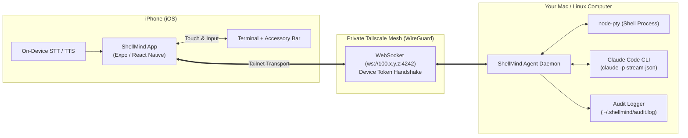

# ShellMind

> **Claude Code on your machine, with a mobile head + voice, reachable from your phone over your private mesh.**  
> *"Talk to your computer from anywhere."*

[](https://github.com/nimat-dev/ShellMind/releases/tag/v1.0.0)
[](https://www.typescriptlang.org/)
[](https://pnpm.io/)
[](https://tailscale.com/)
[]()
[]()

---

## Table of Contents

- [Overview](#overview)
- [Why ShellMind?](#why-shellmind)
- [Key Features](#key-features)
- [System Architecture](#system-architecture)
- [Prerequisites](#prerequisites)
- [Quickstart Guide](#quickstart-guide)
  - [1. Install Dependencies & Build](#1-install-dependencies--build)
  - [2. Pair Your Mobile Device](#2-pair-your-mobile-device)
  - [3. Start the Agent Daemon](#3-start-the-agent-daemon)
  - [4. Install & Launch the Mobile App](#4-install--launch-the-mobile-app)
    - [Method A: Instant via Expo Go (Recommended)](#method-a-instant-via-expo-go-recommended)
    - [Method B: Standalone Native iOS Build](#method-b-standalone-native-ios-build)
  - [5. Pair the Mobile App](#5-pair-the-mobile-app)
- [Using ShellMind](#using-shellmind)
  - [AI Chat & Interactive Permissions](#ai-chat--interactive-permissions)
  - [Mobile-Native PTY Terminal](#mobile-native-pty-terminal)
  - [Push-to-Talk Voice & Spoken Responses](#push-to-talk-voice--spoken-responses)
  - [Host Telemetry](#host-telemetry)
- [Agent CLI Reference](#agent-cli-reference)
- [Security & Privacy](#security--privacy)
- [Testing & Quality Verification](#testing--quality-verification)
- [Troubleshooting & FAQ](#troubleshooting--faq)
- [License](#license)

---

## Overview

Developers leave their desk, but the work doesn't stop: a build is compiling, integration tests are running, a server is misbehaving, or you need to check if a deployment succeeded. Traditional mobile SSH apps squeeze a desktop terminal onto mobile glass—fine for a single command, but painful for real engineering, and they only offer a raw shell rather than intelligent assistance.

**ShellMind bridges your phone directly to the Claude Code agent already logged in on your desktop or laptop.**

- **No API keys or per-token fees**: Uses your existing Claude subscription locally.
- **No cloud relays or third-party servers**: Connects point-to-point over your private **Tailscale** WireGuard mesh.
- **Safety by design**: High-impact tool actions (file edits, bash execution) surface interactive **Allow / Deny** permission cards on your phone.
- **Mobile-first UX**: Features an accessory keyboard bar (`ESC`, `CTRL`, `TAB`, `ALT`, arrows, `^C`), command history modal, gesture scrollback, and push-to-talk voice input.

---

## Why ShellMind?

| Feature | Standard SSH App | Cloud AI Chat App | ShellMind |
| :--- | :---: | :---: | :---: |
| **Execution Environment** | Raw shell only | Sandboxed cloud container | **Your real local machine** |
| **Claude Code Intelligence** | ❌ No | ❌ No (generic LLM) | **✅ Yes (local tools & context)** |
| **Billing / Subscription** | N/A | Separate API tokens | **Uses existing Claude login** |
| **Permission Controls** | Full raw access | Read-only / cloud only | **Interactive Allow/Deny Cards** |
| **Network Security** | Open SSH port / port-forwarding | Cloud servers | **Tailscale WireGuard Mesh** |
| **Mobile Typing UX** | Cramped keyboard | Normal text box | **Accessory bar + voice PTT** |

---

## Key Features

1. **Claude Code Bridge (`claude -p --output-format stream-json`)**
   - Interacts with Claude Code on your machine using your existing CLI subscription.
   - Streamed Markdown responses and tool execution breakdowns.
   - Switch active workspace project directories directly from your phone.
   - Persistent transcript store with session resumption upon reconnecting.

2. **Interactive Permission Bridge & Audit Logging**
   - When Claude plans a tool call (`Bash`, `FileWrite`, `FileEdit`), ShellMind intercepts the request.
   - Renders an interactive card on your phone with the exact command or diff.
   - Choose **Allow Once**, **Always Allow (Session)**, or **Deny**.
   - Every action is recorded in an append-only, tamper-evident audit log (`~/.shellmind/audit.log`).

3. **Mobile-Native PTY Terminal**
   - Real pseudo-terminal spawned via `node-pty`.
   - Custom mobile accessory bar: `ESC`, `CTRL`, `TAB`, `ALT`, arrows (`▲` `▼` `◀` `▶`), and `Ctrl+C`.
   - Gesture-driven scrollback buffer and historical command replay modal.
   - Dynamic viewport resizing (`terminal:resize`).

4. **Push-to-Talk Voice & Spoken Responses**
   - Press and hold to speak commands using on-device speech-to-text (STT).
   - Audio feedback and optional text-to-speech (TTS) voice narration for Claude's responses.

5. **Host Telemetry & Status Monitoring**
   - Real-time CPU load, memory utilization, and disk space tiles.
   - Connection heartbeat with round-trip latency (RTT) tracking.

---

## System Architecture

ShellMind is built as a strict TypeScript monorepo managed with `pnpm` workspaces:

```
ShellMind/
├── packages/
│   ├── protocol/    # Pure types, zod schemas, protocol envelopes (0 side effects)
│   ├── agent/       # Host daemon (Tailnet transport, PTY, Claude driver, audit log)
│   └── mobile/      # Expo React Native client (Chat, Terminal, Status, Voice)
├── scripts/         # Architecture & dependency validation scripts
└── .harness/        # Product requirements, roadmap, and test evidence
```



### Pure Core Architectural Boundary
- `@shellmind/protocol` has **zero external side effects** and **no dependencies on network, filesystem, or OS**. It defines the protocol envelope, zod validation schemas, and message types (`ping`, `pong`, `handshake`, `pty`, `chat`, `permission`, `telemetry`).
- Enforced by `./scripts/check-architecture.sh` and Dependency Cruiser (`.dependency-cruiser.cjs`) on every build.

---

## Prerequisites

Before starting, ensure you have:

1. **Node.js**: `v20.x` or later (`node -v`).
2. **pnpm**: `v9.x` or `v11.x` (`corepack enable && corepack prepare pnpm@latest --activate`).
3. **Tailscale**:
   - Installed and running on your Mac/Linux host.
   - Installed and logged into the **same Tailscale account** on your iPhone.
4. **Claude Code CLI** (for AI features):
   - Installed globally (`npm install -g @anthropic-ai/claude-code`).
   - Authenticated on your machine (`claude login`).

---

## Quickstart Guide

### 1. Install Dependencies & Build

Clone the repository and build all workspace packages:

```bash
# Clone the repository
git clone https://github.com/nimat-dev/ShellMind.git
cd ShellMind

# Install monorepo dependencies
pnpm install

# Compile all packages (protocol, agent, mobile)
pnpm build
```

---

### 2. Pair Your Mobile Device

Generate a secure pairing token for your phone:

```bash
pnpm --filter @shellmind/agent exec shellmind pair "My iPhone"
```

**Output example:**
```text
=== ShellMind Device Paired Successfully ===
Device ID:    dev_muzjcnbg_67d4e310
Device Name:  My iPhone
Tailnet Host: 100.66.103.104
Auth Token:   tok_6ee9738d66ea750fe42228286d5da9b41540a84b43af7f23

Connection Payload (JSON):
{
  "deviceId": "dev_muzjcnbg_67d4e310",
  "token": "tok_6ee9738d66ea750fe42228286d5da9b41540a84b43af7f23",
  "host": "100.66.103.104",
  "port": 4242
}
```

> [!IMPORTANT]
> Keep the generated `token` secure. The token is hashed on disk (`~/.shellmind/devices.json`) and cannot be displayed again.

---

### 3. Start the Agent Daemon

Start the daemon on your machine. By default, it automatically binds to your Tailscale network interface (`100.x.y.z`):

```bash
pnpm --filter @shellmind/agent exec shellmind dev --port 4242
```

**Output:**
```text
=== ShellMind Agent Daemon ===
Interface: utun6 (100.66.103.104)
Port:      4242
Registry:  /Users/username/.shellmind/devices.json

Daemon listening on ws://100.66.103.104:4242
Press Ctrl+C to stop.
```

*(For local testing on a single machine without Tailscale, you can pass `--allow-localhost`)*.

---

### 4. Install & Launch the Mobile App

You can run the mobile client on your iPhone using either **Expo Go** (instant, recommended) or a **Native Standalone Build**.

#### Method A: Instant via Expo Go (Recommended)

No USB cables or Apple Developer account required:

1. **Install Expo Go on your iPhone**:
   - Open the **App Store** on your iPhone.
   - Search for **"Expo Go"** (by *650 Industries*) and install it (free).
   - [Direct App Store Link: Expo Go](https://apps.apple.com/app/expo-go/id982107779)
2. **Start the Expo Metro Bundler on your computer**:
   ```bash
   pnpm --filter @shellmind/mobile exec expo start --port 8081
   ```
3. **Open ShellMind on your iPhone**:
   - Open the **Expo Go** app on your iPhone.
   - Tap **"Enter URL manually"** and input your computer's Tailscale address:
     ```text
     exp://100.66.103.104:8081
     ```
     *(Or enter `exp://10.0.0.x:8081` if your phone is connected to the same local Wi-Fi)*.
   - *Tip*: Once Expo Go is installed on your phone, you can also scan the QR code printed in the terminal or browser.

#### Method B: Standalone Native iOS Build

If you want a permanent app icon (`ShellMind.app`) installed directly to your iPhone without Expo Go:

1. Connect your iPhone to your Mac via USB and tap **Trust This Computer**.
2. On your iPhone, enable **Developer Mode**:
   - Go to **Settings** -> **Privacy & Security** -> **Developer Mode** -> toggle **On** (restart iPhone when prompted).
3. Run the native build command from your Mac:
   ```bash
   pnpm --filter @shellmind/mobile exec expo run:ios --device
   ```

---

### 5. Pair the Mobile App

When ShellMind opens on your iPhone:

1. Tap **Pair Computer** or navigate to the connection screen.
2. Paste the **Connection Payload JSON** generated in Step 2:
   ```json
   {
     "deviceId": "dev_muzjcnbg_67d4e310",
     "token": "tok_6ee9738d66ea750fe42228286d5da9b41540a84b43af7f23",
     "host": "100.66.103.104",
     "port": 4242
   }
   ```
3. Tap **Connect**.
4. The status indicator will turn **ONLINE** with real-time latency (RTT ~ 1–3 ms).

---

## Using ShellMind

ShellMind organizes your workflow into three bottom navigation tabs:

```
[  Chat  ]    [  Terminal  ]    [  Status  ]
```

### AI Chat & Interactive Permissions

- **Chatting with Claude**: Type any question, code investigation prompt, or task in the input box (e.g., *"Why is port 3000 busy?"*, *"Check git status and summarize recent changes"*).
- **Project Selection**: Tap the project selector pill at the top of the Chat screen to switch between directories in your home folder.
- **Permission Cards**: When Claude attempts to run a terminal command or edit a file, an interactive permission card appears:
  - **Command / Path**: Displays the exact bash command or file target.
  - **Allow Once**: Authorizes this specific execution.
  - **Always Allow (Session)**: Adds the tool to the session allowlist for future calls.
  - **Deny**: Rejects the action with an optional explanation sent back to Claude.

### Mobile-Native PTY Terminal

- **Real Terminal**: Connects to your system shell (`zsh`, `bash`).
- **Accessory Bar**:
  - `ESC` / `CTRL` / `TAB` / `ALT`
  - Directional navigation: `▲` `▼` `◀` `▶`
  - Interrupt: `^C` (sends `\x03`)
- **Gesture Scrollback**: Swipe up to browse terminal output buffer without keyboard interference.
- **History Modal**: Tap the clock icon in the top right to view and re-run previous commands.

### Push-to-Talk Voice & Spoken Responses

- **Voice Input**: Press and hold the microphone button to dictate your prompt. Release to submit.
- **Spoken Replies**: Toggle the speaker icon on the Chat screen to hear Claude's responses read aloud via on-device speech synthesis.

### Host Telemetry

Switch to the **Status** tab to monitor:
- **Daemon Version & Hostname**
- **Tailnet Latency**: Continuous ping/pong round-trip time.
- **CPU Utilization**: Active load percentage.
- **Memory**: Used vs. free RAM.
- **Disk Usage**: Root filesystem capacity.

---

## Agent CLI Reference

The `@shellmind/agent` package includes a command-line interface:

```bash
shellmind [command] [options]
```

| Command | Arguments | Description |
| :--- | :--- | :--- |
| `pair` | `[name]` | Pairs a new mobile client and generates credentials. |
| `dev` | `[--port <p>] [--allow-localhost]` | Runs the agent daemon in the foreground. |
| `devices` | *None* | Lists all paired devices and their active/revoked status. |
| `revoke` | `<deviceId>` | Revokes access for a paired device immediately. |
| `status` | *None* | Displays Tailscale interface and device registry status. |

---

## Security & Privacy

1. **Local Execution**:
   - The ShellMind agent daemon runs strictly as your local user account—never as root.
2. **Private Network Mesh**:
   - The agent daemon verifies and binds exclusively to your Tailscale interface (`utun*` / `100.x.y.z`). It does not bind to public internet interfaces (`0.0.0.0`).
3. **Device Token Authentication**:
   - Connections must complete a mutual handshake (`handshake:init` and `handshake:ack`).
   - Tokens are hashed using SHA-256 before storage in `~/.shellmind/devices.json`.
4. **Tamper-Evident Audit Logging**:
   - Every permission grant, denial, and executed command is logged to `~/.shellmind/audit.log` with timestamp, client ID, and outcome.

---

## Testing & Quality Verification

ShellMind maintains a comprehensive test suite with 100% architectural compliance:

```bash
# Run unit & integration tests across all packages
pnpm test

# Run TypeScript typechecks across the monorepo
pnpm typecheck

# Run linter
pnpm lint

# Verify architectural boundaries (no side effects in protocol/core)
pnpm check-architecture

# Run the complete verification gate
pnpm verify
```

---

## Troubleshooting & FAQ

### iPhone Camera says "No data found" when scanning the QR code
**Cause**: The QR code encodes `exp://...`. iOS Camera does not recognize this custom protocol unless the **Expo Go** app is installed.  
**Fix**: Install **Expo Go** from the Apple App Store first. Once installed, re-scan the QR code or enter `exp://<tailscale-ip>:8081` manually inside the Expo Go app.

### App stuck on "OFFLINE" or connection refused
1. **Check Tailscale**: Ensure Tailscale is connected (VPN toggle ON) on **both** your computer and your iPhone.
2. **Verify IP Address**: Run `tailscale status` or `shellmind status` on your computer to verify its `100.x.y.z` IP address matches the `host` in your pairing payload.
3. **Check Firewall**: Ensure port `4242` is not blocked by a local firewall on your computer.

### Claude commands fail or report "not logged in"
1. Verify that Claude Code is installed and logged in by running:
   ```bash
   claude --version
   claude
   ```
2. ShellMind uses your local Claude subscription session and does not require an `ANTHROPIC_API_KEY`.

---

## License

This project is licensed under the [MIT License](LICENSE).
